## Graph Analysis

### First Graph
The target variables seem to be normally distributed.
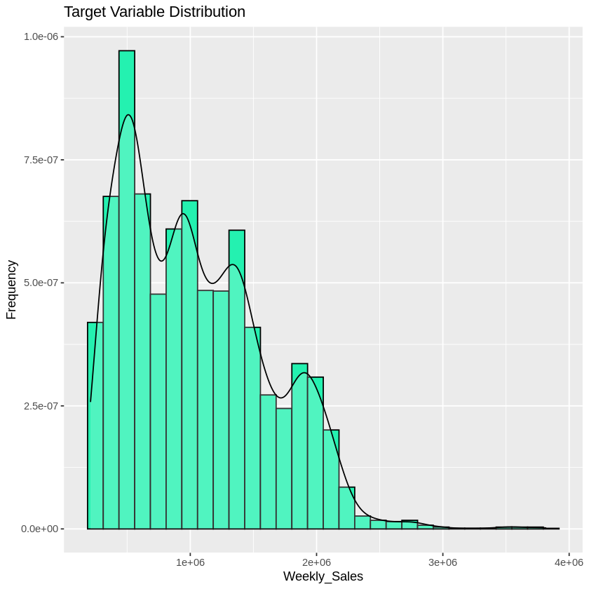

### Second & Third Graph
The correlation between the dependent variable (Weekly-sales) and the independent variables is relatively low.
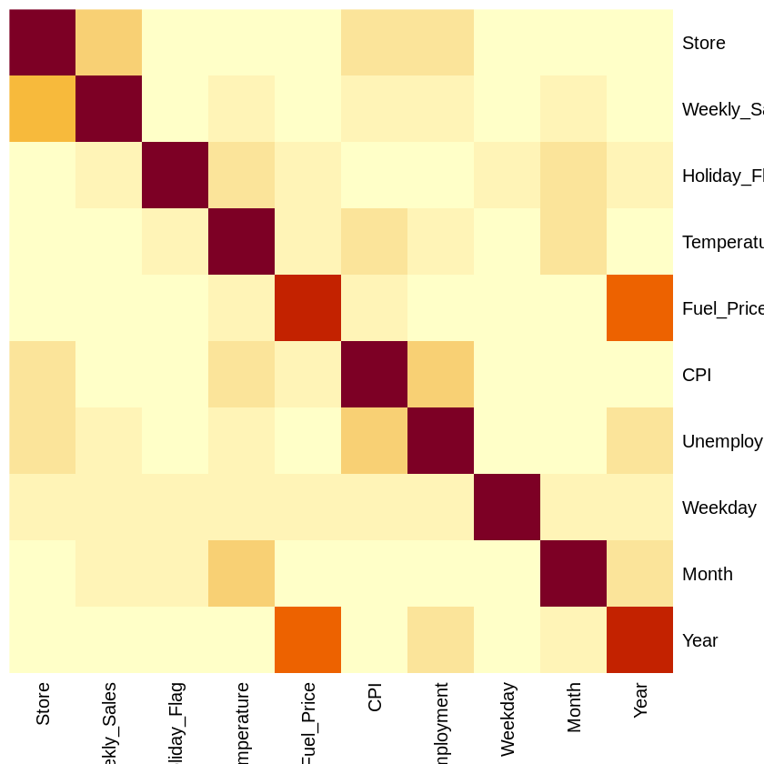
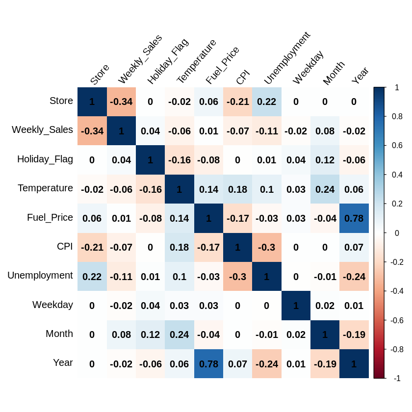

### Fourth Graph
Some dates have extremely high weekly sales.
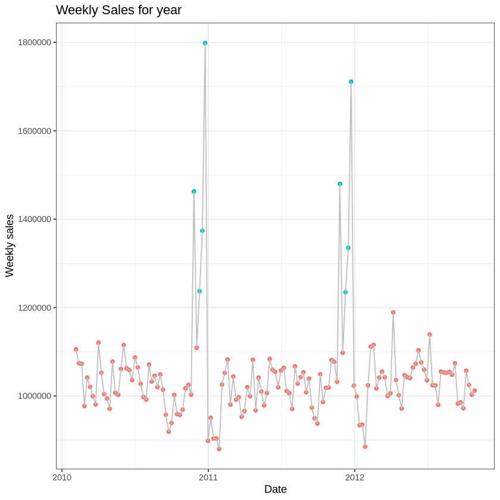

### Fifth Graph
Festivals lead to high weekly sales, especially a week before Christmas and Thanksgiving.
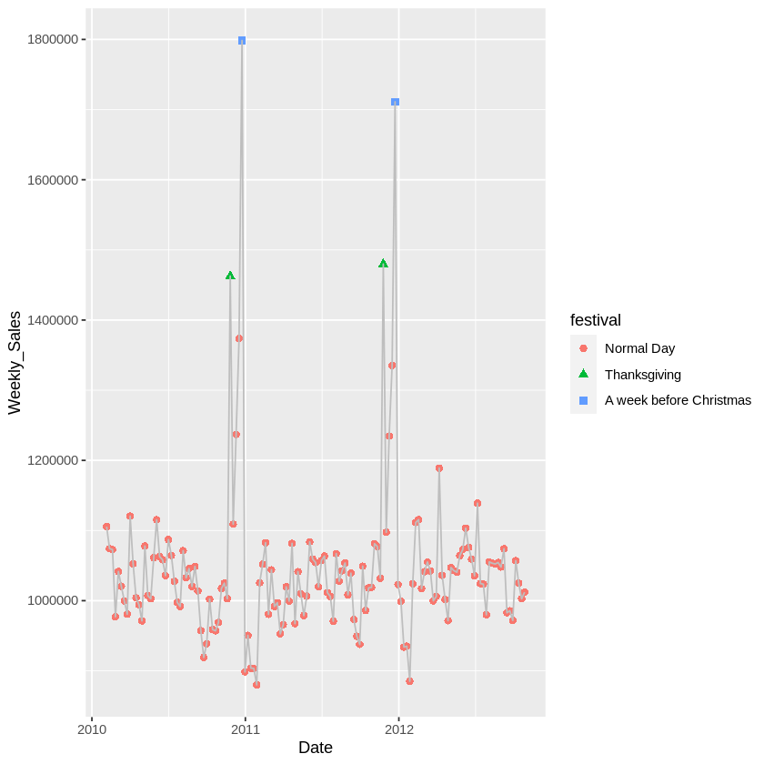

### Sixth & Seventh Graph
2010 and 2011 reported high earnings.
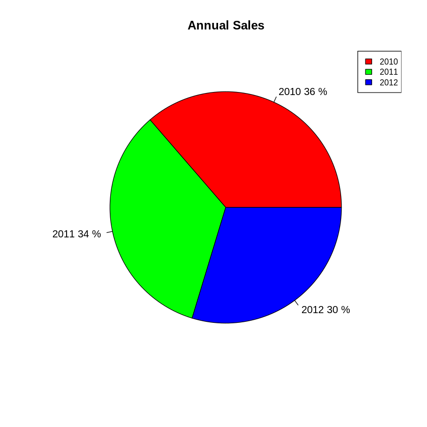
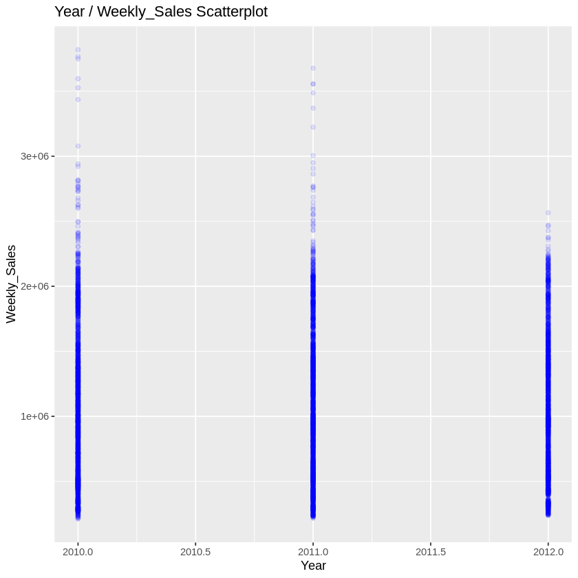

### Eighth Graph
The 20th store reported the highest annual sales.
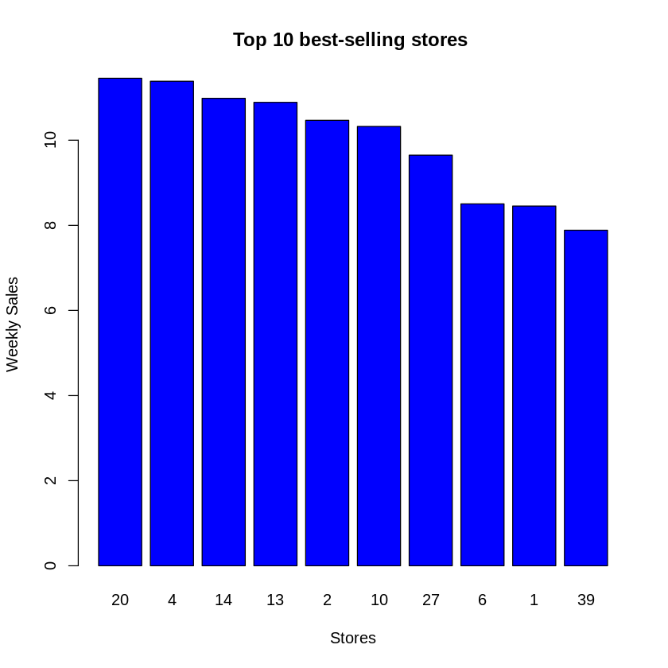

### Ninth & Tenth Graph
1. There are more sales in non-holiday weeks.
2. However, there’s more revenue in holiday weeks.
3. There are outliers in non-holiday weeks.
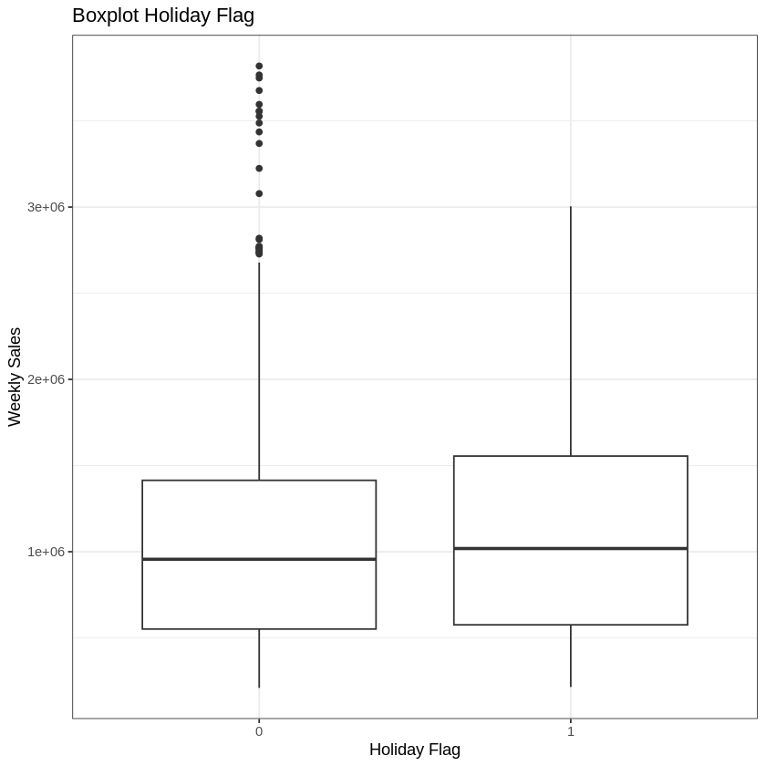
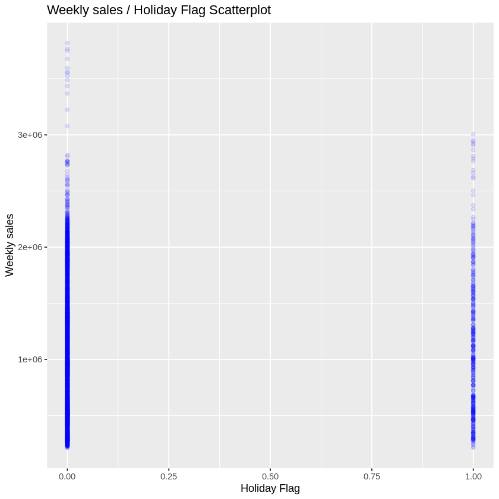

### Eleventh Graph
There are more people shopping at specific fuel prices.
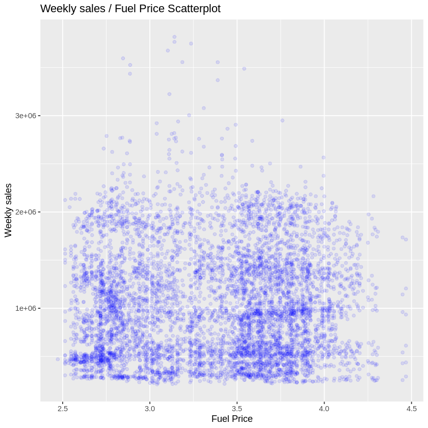

### Twelfth Graph
1. Different ranges of CPI have similar sales distributions.
2. Walmart reported higher profits when fuel prices and CPI were high, and when the temperature was cold.
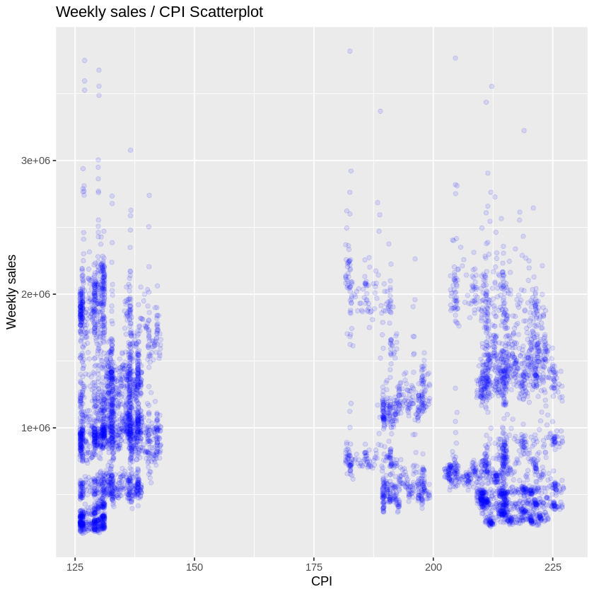

### Thirteenth Graph
Some people go shopping when the temperature is between 40 and 75 degrees Fahrenheit.
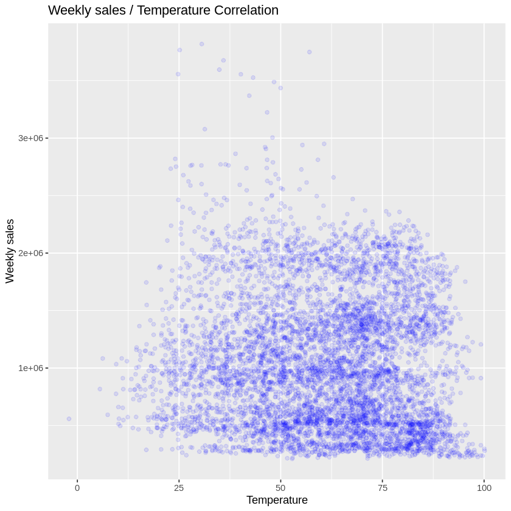

### Fourteenth Graph
Lower unemployment rates are associated with higher weekly sales.
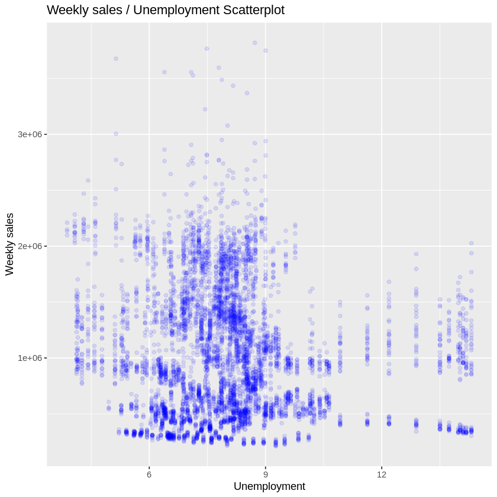

## Inference
1. There is more revenue in holiday weeks.
2. December reported higher revenues.
3. The 14th store reported the highest annual sales.
4. Higher revenues were recorded when fuel prices and CPI were low, and the temperature was hot.

## Conclusion
- The year 2010 had the highest revenues, followed by 2011.
- The stores with the highest revenues are numbers 14, 20, and 4.
- Holidays generally have the highest revenues.
- Revenues are lower when the temperature is low and higher when the temperature is high.
- Revenues are higher when the CPI is low.
- Rising fuel prices do not seem to affect store revenues.
